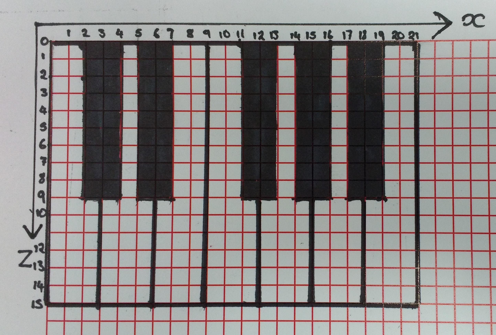

## Planning the keyboard

It's always a good idea to quickly sketch out what you want to build before you start throwing blocks into the Minecraft world. Here's a quick sketch of an octave of a keyboard, showing the `x` and `z` block positions.

