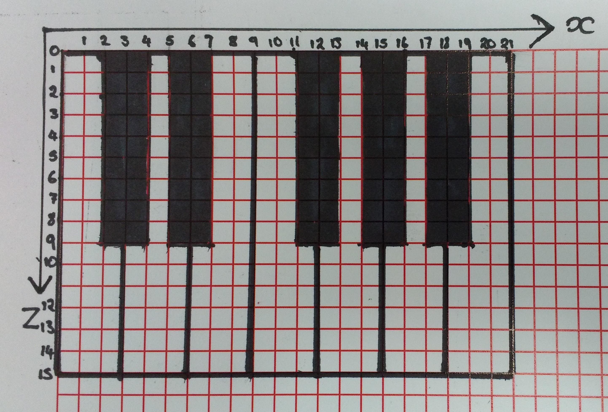

# The big minecraft piano

In this project, you're going to create a piano keyboard in Minecraft that can be played when Steve walks over the keys.

This project uses Sonic Pi to play the music, Minecraft to visualise the piano and act as your input, and Python to build the piano and act as a way for Sonic Pi and Minecraft to communicate with each other.

This project cover lots of computer science concepts, such as creating functions, using for loops, and network communication.

## Receiving messages in Sonic Pi

The first step in this project is to try and send notes from Python to Sonic Pi. This is possible because Sonic Pi uses Open Sound Control (OSC). This is a way for sound synthesizers to communicate with each other over a network.

1. The first thing to do is to tell Sonic Pi to listen out for messages. Load up Sonic Pi by clicking on `Menu` > `Programming` > `Sonic Pi`, and then click into `Buffer 0` to start writing code.

1. You just need a few lines of code in your Sonic Pi file, which are explained below.

	```ruby
	set_sched_ahead_time! 0
	live_loop :listen do
	  message = sync "/play_this"
	  note = message[:args][0]
	  play note
	end
	```
	
	1. `set_sched_ahead_time! 0` tells Sonic Pi to keep listening without any delay, so the notes are played quickly.
	1. `live_loop :listen do` starts a *live loop* that will run forever. Live loops need their own unique names, so this one has been called `listen`.
	1. `message = sync "/play_this"` creates a variable when the message `/play_this` is heard by Sonic Pi. The `message` will be a dictionary.
	1. `note = message[:args][0]` picks out the contents of the message that was sent. In this case, the dictionary contains a *key* called `args`. The value of the key is going to be a list. As you'll be sending one note at a time, the list will only have a single number at position 0.
	1. `play note` will play the MIDI value that was sent.

1. You can now run this script. Nothing will happen yet, because Sonic Pi is not receiving any messages.

## Sending messages to Sonic Pi

1. Open up a new Python 3 file by clicking `Menu` > `Programming` > `Python 3 (IDLE)`, then clicking on `File` > `New File`.

1. You'll need the `python-osc` module for this project, so make sure you have installed it by following the instructions on the [software](https://www.raspberrypi.org/learning/the-big-minecraft-piano/requirements/software/) page.

1. The first few lines you need just import the necessary methods from the module.

	```python
	from pythonosc import osc_message_builder
	from pythonosc import udp_client
	```
	
1. Next, you need to create an object that will send the message. Open Sound Control uses a method of communicating called [UDP](https://simple.wikipedia.org/wiki/User_Datagram_Protocol) (User Datagram Protocol). This is a method computers often use to talk to each other over the internet. You could use this to get two different Raspberry Pis to talk to each other, but your Python program and Sonic Pi script are both running on the same machine.

	As both programs are on the same Raspberry Pi, you can use the *home* address of the Raspberry Pi to tell Python where to send the message. A computer always gives itself the same IP address for programs to talk to each other, which is `127.0.0.1`.

	Messages sent using UDP also need to include a port number. Port numbers let programs know that the message was meant for them. Sonic Pi is going to listen for messages using port number `4559`, so your Python program needs to use this port number in its messages.

	```python
	sender = udp_client.SimpleUDPClient('127.0.0.1', 4559)
	```

1. Save and run your code (`Ctrl`+`S` and then `F5`). Nothing will happen yet, but you can test out the connection in the shell. Switch over to the shell and type the following:

	```python
	>>> sender.send_message('/play_this', 60)
	```

1. You should hear the note *60* being played by Sonic Pi, which is middle C.

1. You can now turn this into a function. Go back to your Python 3 file and create a function that takes a single argument `note` and plays that note.

	```python
	def play_note(note):
		'''Take an integer note value and send it to Sonic Pi'''
		sender.send_message('/play_this', note)
		sleep(0.5)
	```
	
1. If you save and run your code, you can then test out your function in the shell. For instance, each of these lines should play a note.

```python
>>> play_note(60)
>>> play_note(61)
>>> play_note(62)
```

## Building piano keys

It may seem a little daunting to try and build a piano in Minecraft, so it's easier to try and break down the problem into much smaller chunks. This is a process that computer scientists call *decomposition.*

A piano keyboard is made up of repeating groups of 7 white keys and 5 black keys. This is called an **octave**. Building each of these elements one at a time will allow you to easily build a keyboard.

1. Start by creating a new Minecraft world. Click on `Menu` > `Games` `Minecraft`, then click on `Start Game` and finally `Create New World`.

1. To begin with, you need to import the Minecraft Pi module and get the player's current position. Add a few more lines of code so that the start of your file looks like this:

	```python
	from pythonosc import osc_message_builder
	from pythonosc import udp_client
	from mcpi.minecraft import Minecraft
	from time import sleep

	sender = udp_client.SimpleUDPClient('127.0.0.1', 4559)
	mc = Minecraft.create()

	player_x, player_y, player_z  = mc.player.getTilePos()
	```

## Planning the keyboard

It's always a good idea to quickly sketch out what you want to build before you start throwing blocks into the Minecraft world. Here's a quick sketch of an octave of a keyboard, showing the `x` and `z` block positions.



## Clearing some space

1. Depending on where you are in the Minecraft world, you might find your piano could be created in the middle of a mountain. To prevent this you can clear some space with a `bulldozer` function, that will fill a cube around the player with air.

	```python
	def bulldozer(x, y, z):
		mc.setBlocks(x - 30, y - 3, z - 30, x + 30, y + 20, z + 30, 0)
	```
	
1. You can test this out by saving and running your code and then calling the function, with Steve's position, in the shell.

    ```python
	>>> bulldozer(player_x, player_y, player_z)
	```

1. You should see that the environment around Steve has been flattened.

## Building black keys

1. You can use a function to build your first black key. A function is a block of named code that performs some task. You can call this one *black_key*. The function will need to know where to build the black piano key, so it will need three parameters. These parameters will be the x, y, and z position in the Minecraft world where the key needs to be built.

	```python
	def black_key(x, y, z):
	```

1. The next step is to use the `setBlocks` function, to set a few black Minecraft blocks. If you look at the black key on the far left, you can see that it's 2 blocks wide and 9 blocks long. So if the first block is placed at an `x` and `z` coordinate, then you need the one to its right to be placed at `x + 1`, and the ones below it to be placed at `z + 1` up to `z + 8`. All the blocks can be placed at 1 block below the player's position - `y - 1`.

Obsidian seems like a sensible material to build the blocks from. This has a `blockId` of `49`.

	```python
	def black_key(x, y, z):
		mc.setBlocks(x, y - 1, z, x + 1, y - 1, z + 8, 49)
	```

1. Test your code by running it, and then type the following into the shell to *call* your function. Make sure you've moved Steve to a clear bit of space first.

	```python
	>>> black_key(player_x, player_y, player_z)
	```

1. Move Steve around and you should be able to see a black piano key in the Minecraft world.

## Building white keys

1. Have a look at the first white key in the sketch. It's three blocks wide and 15 blocks long. This time, you need to set blocks from `x` up to `x + 2`, and from `z` up to `z + 14`.

You can write a function to do this using the white tile block, which has a `blockId` of `44, 7`. The `44` is the tile block, and the `7` tells Minecraft that it should be white.

	```python
	def white_key(x, y, z):
		mc.setBlocks(x, y - 1, z, x + 2, y - 1, z + 14, 44, 7)
	```

1. Again, you can run your code and then type the following into the shell to see the white key being produced.

	```python
	>>> white_key(player_x, player_y, player_z)
	```

## Investigating `for` loops

For the next section, you're going to need to use a `for` loop to place multiple keys. You can experiment with `for` loops if you're unsure how they work; to do this click on `File` > `New File` and write some test code in a new blank file.

1. You can write a simple `for` loop in your new file. This loop will make sure each value is printed with commas separating the numbers.

	```python
	for i in range(19):
		print(i, end = ',')

	>>> 0,1,2,3,4,5,6,7,8,9,10,11,12,13,14,15,16,17,18,
	```

1. You can see that the first value is `0` and the last is `20`.

If you wanted to get every third number, then you need to add a step value to the `range()` function. Here, the function provides values from `0` to `20` with a step value of `3`.
	
	```python
	for i in range(0, 19, 3):
		print(i, end = ',')

	>>> 0,3,6,9,12,15,18,
	```
	
## Making an octave

One octave consists of 7 white notes and 5 black notes. If you look at the sketch, you can see that the blocks stretch from `x` to `x + 18`. The `for` loop needs to place a white key every 3 block-units on the `x` axis from `0` up to `18`.

1. Now you can start making your octave function, placing a white key at every position provided by `i`.

	```python
	def make_octave(x, y, z):
		for i in range(0, 19, 3):
			white_key(player_x + i, player_y, player_z)
	```

1. Save and run your code, then type `make_octave(player_x, player_y, player_z)` into the shell. You should see your white keys being placed in your Minecraft world.

1. Next is the black keys. You can use the same system for placing these. Look at the sketch again. This time, the black keys need to be placed starting at `x = 2`. Within the `make_octave` function you can add another `for` loop.

	```python
	def make_octave(x, y, z):
		for i in range(0, 19, 3):
			white_key(player_x + i, player_y, player_z)
		for i in range(2, 18, 3):
			black_key(player_x + i, player_y, player_z)
	```

1. Save and run your code again, then call the `make_octave` function.

1. If you look at your octave, it's nearly done. There's just one key too many. A key has been placed at `x = 8`, and you need to make sure that this key is missed out. A little bit of conditional selection will help with this. If the value of `i` is `8` then the `black_key` function should not be called. Another way of putting this is *if i is not equal to 8" then the `black_key` function should be called.* Add this conditional to your function:

	```python
	def make_octave(x, y, z):
		for i in range(0, 19, 3):
			white_key(player_x + i, player_y, player_z)
		for i in range(2, 18, 3):
			if i != 8:  ## leave a space as only 5 black keys
				black_key(player_x + i, player_y, player_z)
	```

1. Save and run your code, and then call the `make_octave` function. You should see a piano octave being produced.
	
## Making the octave again

1. Let's tie all that together now. At the end of all the functions you've made, you can now call the functions in your code, and use three lines to set it all up. First bulldoze the area, then make the piano, and then on the last line set the player's position, so that Steve moves to the middle of the piano.

	```python
	bulldozer(player_x, player_y, player_z)
	make_octave(player_x, player_y, player_z)
	mc.player.setPos(player_x + 8, player_y + 3, player_z + 12)
	```

1. Now when you save and run your code a piano octave should appear beneath your feet. Each time you run the code, a new octave will be produced.

## Playing your piano

The next step is to have the piano play a note when Steve walks over a key.

1. To begin you'll need an infinite loop that will constantly get Steve's latest position. All your code from now on needs to be placed **inside** this `while True` loop.

	```python
	while True:
		new_x, new_y, new_z = mc.player.getTilePos()
	```

1. Next, you need to find the block below Steve's feet. The problem is that the white keys are only half a block in height. If Steve is standing on a white tile, because of their smaller height `block_below` ends up being the air that's beneath the piano. You can handle this with a conditional, and check if the block below is not a white or black key.

	```python
		block_below = mc.getBlock(new_x, new_y - 1, new_z)
		if block_below != 44 and block_below != 49:
			block_below = mc.getBlock(new_x, new_y, new_z)
	```

1. You can now find Steve's position relative to the piano's position. The piano was placed at `player_x`, but Steve is now standing at `new_x`. Subtracting one from the other will tell you where Steve is standing on the piano octave.

	```python
		relative_position = player_x - new_x ## find the position on the piano
	```

1. Now you can make a list of the notes to be played. Starting from middle C, the white notes have MIDI values of 60, 62, 64, 65, 67, 68, and 71. The black notes are the MIDI values in between the white notes. You can place a 0 into the `black_notes` as there are only 5 of them on the keyboard.

	```python
		white_notes = [60, 62, 64, 65, 67, 69, 71]
		black_notes = [61, 63, 0,  66, 68, 70]
	```

1. The specific white note to play, if Steve is standing on the white note, can be found by dividing his relative `x` position by 3 and then ignoring the remainder. This is called floor division, and can be done in Python using the `//` operator.

	```python
		if block_below == 44:
			notes_along = relative_position // -3
			play_note(white_notes[notes_along])
	```

1. You can find the black note to play by subtracting `1` from Steve's relative position, floor dividing by 3, and then subtracting `1` again. This is because the notes are only 2 blocks wide.

	```python
		if block_below == 49:
			notes_along = ((relative_position - 1) // -3) - 1 
			play_note(black_notes[notes_along])
	```

1. And that's it. Try running your code and then moving over the blocks. So long as Sonic Pi is open and running your initial script, you should hear the piano being played each time Steve is on a particular key.

## What next?

- You could try and increase the size of your piano, by calling the `make_octave` function in a `for` loop. You'll also need to add more values to your `black_notes` and `white_notes`.

- Alter your Sonic Pi script, so that it uses different synths. You can find more at [Getting Started with Sonic Pi]().

- Add a few LEDs into a breadboard, and you can make them light up when the keys are pressed. Or maybe the piano keys could change colour when they are stepped on.

- It's a little difficult to differentiate between the white keys at the moment. Could they be redrawn as a different coloured tile each time they are played?
